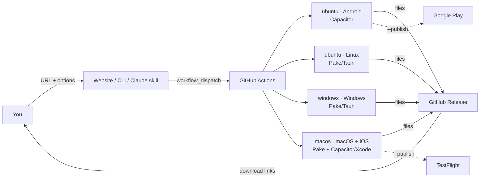

<div align="center">

# 🦢 Origami

**Fold any website into native apps for Android, iOS, Windows, macOS and Linux.**

One URL in, five platforms out. Use it as a website, a CLI or a Claude Code skill, and publish straight to Google Play and the App Store.


[Features](#-features) · [Quick start](#-quick-start) · [Store publishing](#-store-publishing) · [Self-hosting](#-self-hosting) · [FAQ](#-faq)

</div>

---

## ✨ Features

| | |
|---|---|
| 🌐 **Website → 5 platforms** | Android `.apk`/`.aab`, iOS `.ipa`/Xcode project, Windows `.msi`, macOS `.dmg`, Linux `.deb` + `.AppImage` |
| 🎨 **Custom icon & splash screen** | Give it one image and Origami generates all 74 Android icon/splash sizes (and the iOS set), including dark-mode splash screens. If you don't give an icon, it uses the site's favicon. |
| 📴 **Offline page** | When there's no internet, the app shows a branded "You're offline" screen with a Retry button instead of a browser error. |
| 🔏 **Signed release builds** | A Play-ready signed AAB/APK, and an App Store-signed IPA (Xcode creates the certificates automatically through the App Store Connect API) |
| 🚀 **Store publishing** | One flag uploads to the **Google Play** internal track and to **TestFlight** |
| ☁️ **No build servers** | Every OS builds on GitHub Actions runners, including iOS and macOS from a Windows PC |
| 🪶 **Tiny desktop apps** | Tauri-based, about 5 MB instead of Electron's 100+ MB |
| 🧩 **Three ways to use it** | Public website, `origami` CLI, and a Claude Code skill. All three share one build pipeline. |
| 🔢 **Store-safe versioning** | You set the version (`1.2.0`). The build number goes up automatically, so store uploads are never rejected as duplicates. |

## 🧠 How it works



Your app is a native shell around your **live website**, so when you update the site, every app updates instantly with no re-release needed. Links to other domains open in the system browser.

## 🚀 Quick start

### 1. Website

Open the hosted site, enter a URL, tick the platforms you want, and click **Build apps**. Download links appear as each platform finishes (about 5–15 min).

### 2. CLI

```bash
git clone https://github.com/<you>/origami && cd origami && npm install

# Test builds on your own machine (whatever the host OS supports)
node bin/origami.mjs https://example.com --name "Example" --targets android,windows

# Every platform, built on GitHub Actions
node bin/origami.mjs https://example.com --name "Example" \
  --targets android,ios,windows,macos,linux --remote --repo <you>/origami

# Branded, signed and published
node bin/origami.mjs https://example.com --name "Example" --targets android,ios \
  --icon https://example.com/icon-1024.png --color "#0d1117" \
  --app-id com.example.app --app-version 1.0.0 --publish --remote
```

| Option | Description | Default |
|---|---|---|
| `--name` | App name (letters, numbers, spaces; max 30) | *required* |
| `--targets` | `android,ios,windows,macos,linux` | *required* |
| `--icon URL` | App icon; a 1024×1024 PNG is best | site favicon |
| `--app-id ID` | App / bundle ID, e.g. `com.company.app` | `app.origami.<name>` |
| `--app-version X.Y.Z` | Version shown in stores | `1.0.0` |
| `--color #RRGGBB` | Icon background, splash screen and offline-page color | `#ffffff` |
| `--sign` | Signed release builds (AAB/APK, IPA) | off |
| `--publish` | Signed builds + upload to Play & TestFlight (implies `--sign`) | off |
| `--remote` | Build on GitHub Actions and download the results | off |
| `--repo owner/repo` | Repo that hosts the workflow | `$ORIGAMI_REPO` |
| `--out DIR` | Output folder | `./out` |

**Local prerequisites:** Node 22+. Desktop builds need [Rust](https://rustup.rs). Android needs JDK 21 and the Android SDK (`ANDROID_HOME`). iOS needs a Mac with Xcode. `--remote` needs the [GitHub CLI](https://cli.github.com) (`gh auth login`).

### 3. Claude Code skill

```bash
cp -r skill/origami ~/.claude/skills/origami
```

Then just ask Claude: *"turn example.com into an Android and Windows app"*. The skill asks for your options, checks prerequisites and runs the build.

## 📦 Store publishing

Publishing uses **your own** developer accounts and keys, so it runs in **your own copy** of this repo. The public website never asks for credentials. Use a **private** repo for publishing, because signed files are attached to the GitHub Release.

Add each value under **Settings → Secrets and variables → Actions**, or with `gh secret set NAME`.

### Google Play

1. **Create an upload keystore** (once, and keep a backup; losing it means you can't update your app):
   ```bash
   keytool -genkeypair -v -keystore release.keystore -alias upload -keyalg RSA -keysize 2048 -validity 10000
   base64 -w0 release.keystore > keystore.b64        # macOS: base64 -i release.keystore -o keystore.b64
   ```
2. **Create a service account** in Google Cloud with the Play Android Developer API enabled. Download its JSON key, then invite its email in **Play Console → Users and permissions** with release permissions.
3. **Create the app in Play Console** with the same package name as `--app-id`. Google requires the **first** AAB to be uploaded by hand: run with `--sign`, upload `out/<name>.aab` once, and every later `--publish` run is automatic.

| Secret | Value |
|---|---|
| `ANDROID_KEYSTORE_BASE64` | contents of `keystore.b64` |
| `ANDROID_KEYSTORE_PASSWORD` | keystore password |
| `ANDROID_KEY_ALIAS` | `upload` (or the alias you chose) |
| `ANDROID_KEY_PASSWORD` | key password |
| `PLAY_SERVICE_ACCOUNT_JSON` | full service-account JSON (needed for `--publish` only) |

Uploads go to the **internal** track as a **draft**. You promote them to production in Play Console.

### Apple App Store

1. Join the [Apple Developer Program](https://developer.apple.com/programs/) ($99/yr).
2. In **App Store Connect → Apps**, create the app with the bundle ID equal to `--app-id`.
3. In **App Store Connect → Users and Access → Integrations → App Store Connect API**, create a key with the **Admin** role. Admin is needed so Xcode can create certificates and profiles automatically. Download the `.p8` file (you can only download it once).

| Secret | Value |
|---|---|
| `APPLE_TEAM_ID` | 10-character Team ID (Membership page) |
| `ASC_KEY_ID` | API key ID |
| `ASC_ISSUER_ID` | Issuer ID shown above the keys list |
| `ASC_KEY_P8` | full contents of the `.p8` file |

`--sign` gives you a signed `.ipa`. `--publish` uploads it to App Store Connect, and it shows up in **TestFlight** after processing (about 10–30 min).

> ⚠️ Apple often rejects apps that only show a website (**guideline 4.2, minimum functionality**). Your app has a much better chance if it offers real app value: login, push notifications or native-feeling navigation. Google Play is far more lenient.

## 🏠 Self-hosting

1. **Fork or push** this repo to GitHub (branch `main`). A **public** repo gets free Actions minutes. On private repos, macOS minutes are billed at 10×.
2. **Create a fine-grained token** scoped to that repo only, with **Actions: read/write** and **Contents: read/write**.
3. **Run the website**:
   ```bash
   cp .env.example .env.local      # set GITHUB_TOKEN and GITHUB_REPO=owner/repo
   npm install && npm run dev      # http://localhost:3000
   ```
4. **Deploy** to Vercel (`vercel deploy`) with the same two env vars.
5. **Protect it** with a Vercel Firewall rate-limit rule on `POST /`, e.g. 3 builds per IP per hour.

## 🗂 Project structure

```
origami/
├── app/                      # Next.js website
│   ├── page.tsx              #   build form
│   ├── actions.ts            #   validates input, starts the GitHub workflow
│   └── job/[id]/page.tsx     #   live status + download links
├── bin/origami.mjs           # CLI (local or --remote builds)
├── scripts/
│   ├── build.mjs             # builds one target (Pake / Capacitor / Xcode), shared by everything
│   ├── validate.mjs          # input rules shared by site, CLI and CI
│   └── validate.test.mjs     # npm test
├── skill/origami/SKILL.md    # Claude Code skill
└── .github/workflows/build.yml  # build matrix + release + store upload
```

## ❓ FAQ

<details><summary><b>Can Origami convert a Windows .exe into an Android app (or similar)?</b></summary>

No. A compiled app is machine code for one OS and can't be converted, only emulated (Wine, Winlator). Origami converts **websites**.
</details>

<details><summary><b>Does the app work offline?</b></summary>

It shows a branded offline screen with a Retry button. Full offline use depends on your website, e.g. a service worker.
</details>

<details><summary><b>Do I need to rebuild when my website changes?</b></summary>

No. The app loads your live site. Rebuild only to change the name, icon, color or version.
</details>

<details><summary><b>Why is my icon blurry?</b></summary>

Without `--icon`, Origami uses the site's favicon, which is often only 256 px. Pass a 1024×1024 PNG.
</details>

<details><summary><b>Are the desktop apps signed?</b></summary>

Not yet. Windows SmartScreen and macOS Gatekeeper show a warning on first launch. See the roadmap.
</details>

## 🗺 Roadmap

- [ ] Desktop code signing (Windows Authenticode, macOS notarization)
- [ ] Microsoft Store and Mac App Store publishing
- [ ] Push notifications (FCM / APNs)
- [ ] Native bottom tab bar and pull-to-refresh
- [ ] Deep links (`https://example.com/*` opens the app)
- [ ] User accounts with build history

## 🤝 Contributing

Issues and PRs are welcome. Run `npm test` and `npx tsc --noEmit` before opening a PR. Every platform's build logic lives in one place, `scripts/build.mjs`, so a fix there helps the website, the CLI and the skill at once.

## 🙏 Built on

[Capacitor](https://capacitorjs.com) · [Pake](https://github.com/tw93/Pake) / [Tauri](https://tauri.app) · [@capacitor/assets](https://github.com/ionic-team/capacitor-assets) · [upload-google-play](https://github.com/r0adkll/upload-google-play) · [Next.js](https://nextjs.org)

## 📄 License

[MIT](LICENSE)
